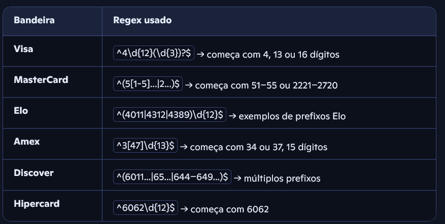
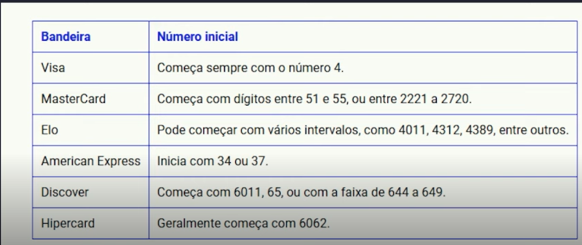

# Validador de Cartoes

## Descrição do Desafio
Este projeto tem como objetivo desenvolver uma aplicação simples capaz de identificar a bandeira de um cartão de crédito (como Visa, MasterCard, etc.) com base no número do cartão. Utilizando o GitHub Copilot como assistente de codificação, exploramos como a inteligência artificial pode acelerar o desenvolvimento, sugerir trechos de código e melhorar a produtividade.

# Tecnologias 
1. C#
2. Copilot 

### Prompt utilizado 
``create a function to validate a number credit card with base image to discover the fiels 'bandeira', create using C#. Valide usando regex.
`` 
### Explicações dos padrões

### Imagem de referência 

